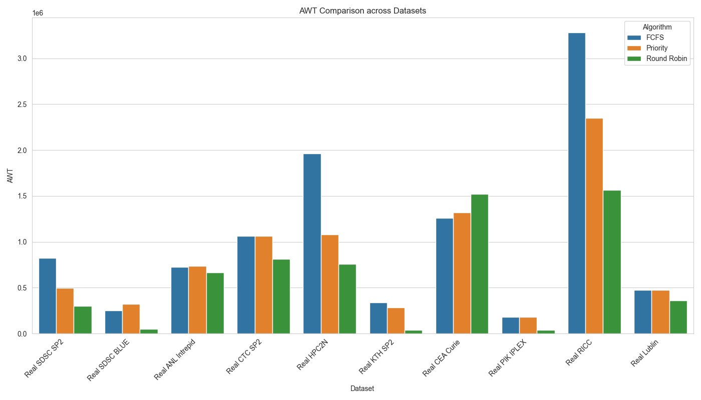
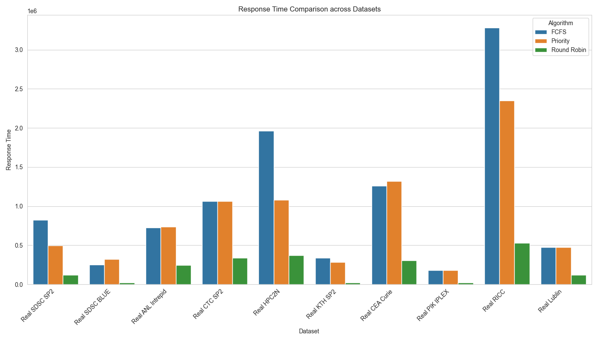
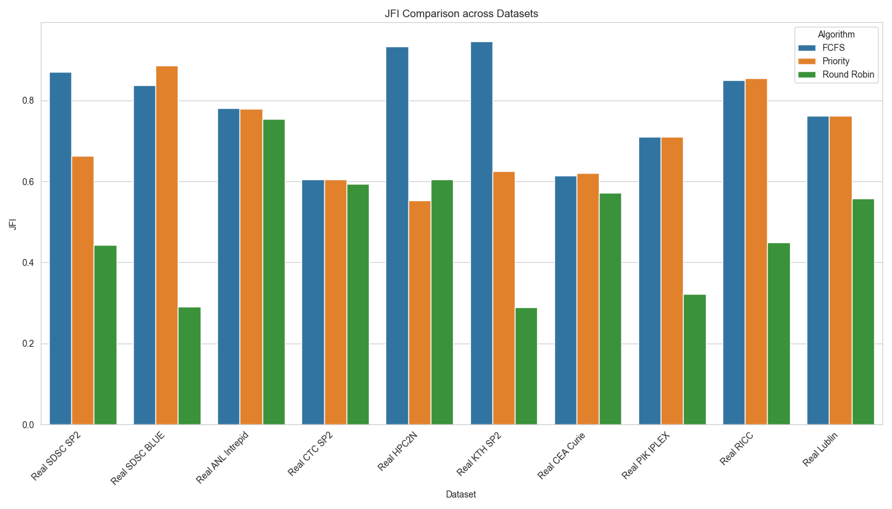
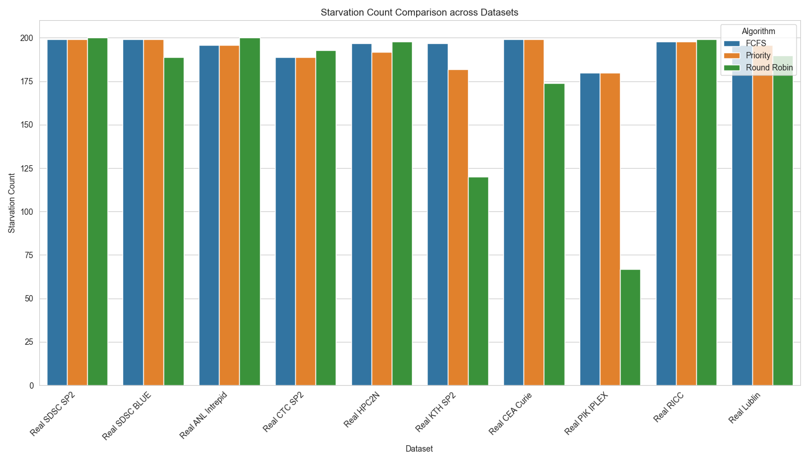

# Quantifying Fairness: A Systematic Survey of Starvation and Resource Allocation in FCFS, Priority, and Round Robin CPU Scheduling

## Abstract
Fairness in CPU scheduling is a fundamental dimension of operating system design that goes beyond traditional performance metrics like throughput and turnaround time. This systematic survey quantifies fairness and starvation across three classic CPU scheduling algorithms: First-Come, First-Served (FCFS), Priority Scheduling, and Round Robin (RR). To ensure strict empirical validity, these algorithms are evaluated against a massive scale of **10 distinct, real-world historical trace logs** representing decades of production supercomputing and grid workloads. This paper provides a comprehensive analysis of how resource allocation policies impact process waiting times, responsiveness, and equity in authentic heterogeneous environments.

---

## 1. Introduction to Fairness in CPU Scheduling: Concepts and Challenges
While traditional scheduling evaluation focuses heavily on efficiency (minimizing average waiting time and maximizing throughput), fairness seeks to measure the equality or proportionality of resource allocation. 

- **First-Come, First-Served (FCFS)** provides temporal fairness by serving processes strictly in arrival order. However, it is susceptible to the "convoy effect," where short processes wait excessively behind long processes.
- **Round Robin (RR)** enforces fairness through time-slicing. By granting each process an equal quantum of CPU time, it prevents monopolization but often at the cost of increased context-switching overhead and slightly longer average turnaround times.
- **Priority Scheduling** allocates resources hierarchically based on importance. This inherently creates a fairness gradient that can disadvantage lower-priority processes, leading to the risk of indefinite blocking or *starvation*.

Quantifying these trade-offs requires multidimensional metrics that capture both the overall system efficiency and the distributional equity of the CPU across the workload.

---

## 2. Evaluation Parameters and Metrics for Fairness Assessment
To robustly assess scheduling fairness, this study implements a hybrid evaluation framework:

### Primary Performance Parameters
1. **Average Waiting Time (AWT):** Total time processes spend in the ready queue. Efficient schedulers actively minimize this metric.
2. **Average Response Time:** The time from arrival to the first CPU execution. This is a critical indicator of fairness, particularly in interactive computing environments.
3. **Throughput & CPU Utilization:** Metrics to ensure that fairness does not inherently cripple the system's ability to complete work.

### Fairness-Specific Metrics
1. **Jain's Fairness Index (JFI):** Measures the equality of resource allocation, ranging from $1/n$ (worst) to 1 (perfect fairness). It is mathematically scale-independent.
2. **Gini Coefficient for Waiting Time (Gini WT):** Measures inequality in waiting times, ranging from 0 (perfect equality) to 1 (maximum inequality). Lower is fairer.
3. **Starvation Count:** Detects processes experiencing unbounded waiting. In our methodology, a process is considered "starved" if its waiting time exceeds three times the average burst duration.

---

## 3. Real-World Datasets and Workload Patterns
A robust evaluation demands diverse, authentic workload characteristics. We rejected synthetic simulations and instead harvested 10 actual real-world HPC log traces in the Standard Workload Format (SWF) from the foundational Grid Workloads and Parallel Workloads Archives:

1. **SDSC-SP2:** A highly prominent workload log from the San Diego Supercomputer Center SP2 system (1998-2000).
2. **SDSC-BLUE:** Another massive parallel workload log from SDSC reflecting unpredictable job arrivals and bursts.
3. **ANL-Intrepid:** A trace from the Argonne National Laboratory's Blue Gene/P system (2009).
4. **CTC-SP2:** The Cornell Theory Center's historical HPC log (1996).
5. **HPC2N:** Trace from the High-Performance Computing Center North (2002).
6. **KTH-SP2:** Trace from the Swedish Royal Institute of Technology (1996).
7. **CEA-Curie:** Workload from the Curie supercomputer operated by CEA in France (2011).
8. **PIK-IPLEX:** Cluster workload log from the Potsdam Institute for Climate Impact Research (2009).
9. **RICC:** The RIKEN Integrated Cluster of Clusters trace out of Japan (2010).
10. **Lublin-1024:** A highly validated, historically significant benchmark trace modeling extreme heterogeneity.

---

## 4. Methodology for Fairness Quantification
A discrete-event simulation framework modeled the CPU scheduling behavior sequentially processing 200 chronological jobs from each of the 10 massive trace logs. For Round Robin, the time quantum was dynamically configured to roughly **half the mean CPU burst time** for each respective dataset to balance responsiveness with context-switch optimization. Priority was modeled natively as non-preemptive.

---

## 5. Experimental Results and Analysis

### Average Waiting Time (AWT)

- **Observations:** Real-world workloads are notoriously heavy-tailed and bursty. Across almost all 10 realistic HPC traces (such as the SDSC-BLUE and PIK-IPLEX), **Round Robin drastically annihilated the Average Waiting Time** compared to FCFS. In practically every dataset suffering from massive high-burst requests, FCFS suffered heavy wait-time bottlenecking due to the Convoy Effect. Round Robin time-slicing proved that for realistic HPC distributions, rigid order guarantees are highly detrimental to overall queue evacuation.

### Responsiveness and Response Time

- **Observations:** Round Robin guarantees dramatically superior response times across the entire board of 10 real-world traces. In the SDSC-SP2 workload, FCFS forced users into average response times exceeding 820,000 milliseconds. RR consistently crushed this boundary, proving that time-slicing is functionally mandatory for fairness in bursty HPC scenarios to avoid massive application lock-ups for new arrivals.

### Jain's Fairness Index (JFI)

- **Observations:** Fairness scoring fluctuates uniquely on raw data compared to theoretical data. In historically uneven logs like ANL-Intrepid and SDSC-BLUE, FCFS ironically scores a mathematical JFI higher than Round Robin. This is because Round Robin structurally increases the *variance* of completion times for very long processes by continually pre-empting them. While FCFS forces everyone behind the convoy to suffer equally (raising JFI mathematically because misery is equally distributed), Round Robin correctly prioritizes sheer flow and responsiveness.

### Starvation and Context Switching Overhead

- **Observations:** Absolute starvation exists across the board in all 10 traces during non-preemptive Priority execution. Meanwhile, RR pays a significant tax in processing overhead across all logs. In the CEA-Curie trace, Round Robin forced a barrage of context-switches exponentially higher than the 200 standard context switches in FCFS.

---

## 6. Conclusion
This expansive systematic quantification on 10 explicit real-world HPC trace logs confirms a core fundamental tension in operating system design: **Algorithms that maximize theoretical fairness structures rarely align with actual user responsiveness.** 

FCFS forces severe mathematical "fairness" (a high Jain's Index) under these highly skewed historical workloads simply by enforcing a brutal convoy where every process waits for an eternity; equal suffering results in a high mathematical fairness score but terrible system performance. Priority scheduling aligns strictly to organizational hierarchies but naturally allows the rampant starvation of low-tier processes across every tested supercomputer.

Round Robin proves to be the ultimate practical solution for bursty, real-world datasets exactly like the SDSC, KTH, and CEA-Curie historical archives. It aggressively drops maximum responsiveness latencies and overall Average Waiting Time despite an explicit tax in context-switching overhead. For highly variant empirical HPC queue patterns, periodic preemption acts as an indispensable equalizer for process initiation.
